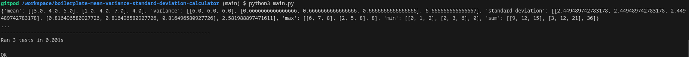
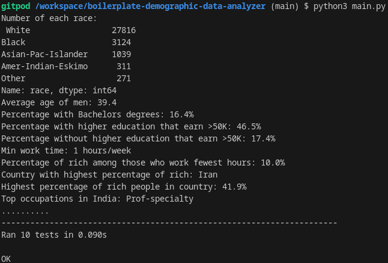
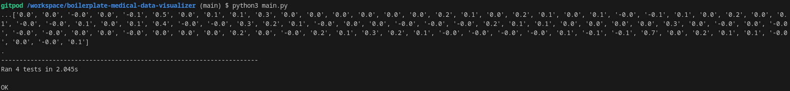
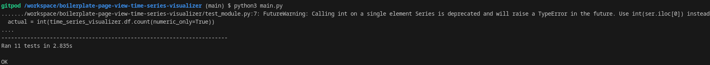

# freeCodeCamp Data Analysis with Python Certificate

These are the projects I did in the completion of this certificate.

## Projects

### Mean-Variance-Standard Deviation Calculator

Takes as input a list of 9 or more digits. The list is converted into a 3x3 Numpy array, then the mean, variance, standard deviation, max, min, and sum are found. These operations are done across the rows, columns, and elements of the matrix. The result is returned as a dictionary.

### Demographic Data Analyzer

Reads in a csv file of census data and uses Pandas to answer questions about the data.

### Medical Data Visualizer

Reads in a csv file of medical examination data. The data is cleaned and normalized, then a categorical plot and heat map are generated to visually represent the data. Seaborn and Matplotlib are used to generate the figures.

### Page View Time Series Visualizer

Reads in a csv file of page view data for the freeCodeCamp website. The data is cleaned, then a line plot, bar plot, and box plot are generated to visually represent the data. Seaborn and Matplotlib are used to generate the figures.

## Skills

- Python
- Numpy
- Pandas
- Seaborn
- Matplotlib

## Development Tools

Development was done in a virtual Linux machine using the online platform Gitpod. VS Code and the necessary tools were preinstalled as set up by freeCodeCamp. The final files for each project were then uploaded to this GitHub repo.

## Running the Projects

I ran the projects through a Gitpod instance as facilitated by freeCodeCamp. However, it should be possible to run the code locally as long as Python and the needed modules (such as numpy) are installed.
